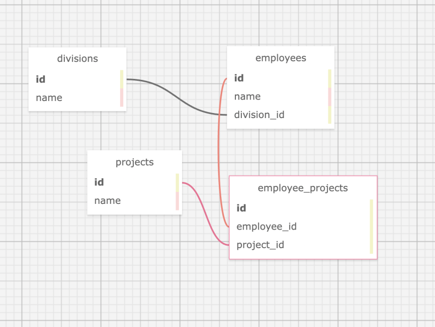

# _Employee Project_

#### _Ruby week 4 Rails with Active Record Practice project for Epicodus Bootcamp_

#### Created By: **Christopher Neal, Frank Proulx, Morgan Waites, Matt Casperson, Drew Henderson, Isaac Overstreet**

## Technologies Used

* _Ruby_
* _Gems_
* _Bundler_
* _RSpec_
* _shoulda matchers_
* _IRB_
* _Pry_
* _Capybara_
* _Postgres_
* _SQL_
* _SQL Designer_
* _Rails_
* _ActiveRecord_
* _Bootstrap scss_
* _faker_

## Description

_This project was created for Epicodus bootcamp to show proficiency in Rails with Active Record. The application is for a company to organize employees and projects. The user can add/remove/edit company departments, employees, and projects.  The user can assign employees to projects._

## Database Schema

## System Requirements

* Ruby v2.6.5 recommended
* Postgres 12.9  
_(Note: Ruby gem dependencies will be installed automatically by Bundler.)_

## Setup/Installation Requirements

* Clone the GitHub repository: [https://github.com/christophermneal/rails_employee_tracker](https://github.com/christophermneal/rails_employee_tracker)
* From the main project directory, enter `bundle install` in the terminal to populate gems.
* To create a database, type in your terminal:  
      `rake db:seed`
* Enter `rspec` into the terminal to confirm passing of all tests.
* Run `rails s` to start the Rails server.
* Open browswer and enter the url http://localhost:3000/ unless otherwise prompted in the terminal.

## Known Bugs

* _None at this time._

## License

_[MIT](https://opensource.org/licenses/MIT)_
Copyright (c) _2021_ _Christopher Neal, Frank Proulx, Morgan Waites, Matt Casperson, Drew Henderson, Isaac Overstreet_

## Support and Contact Details
* _[christopher.m.neal@gmail.com](mailto:christopher.m.neal@gmail.com)_
